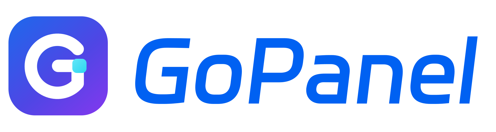
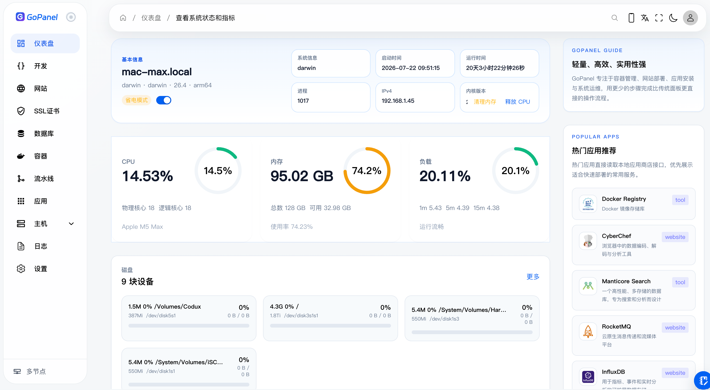

<p align="center">
  <a href="https://gopanel.cn/">
    
  </a>
</p>

<p align="center"><strong>The self-hosted AI development and delivery cockpit for solo founders and small teams.</strong></p>

<p align="center">
  Delegate development from your phone, follow structured progress, review code, approve risky actions, and operate the infrastructure that ships your product.
</p>

<p align="center">
  <a href="./LICENSE"></a>
  <a href="https://github.com/aihop/gopanel/releases"></a>
  <a href="https://github.com/aihop/gopanel"></a>
  <a href="https://gopanel.cn/"></a>
</p>

<p align="center">
  <a href="./README.md"></a>
  <a href="./README_zh.md"></a>
</p>

<p align="center">
  <a href="https://gopanel.cn/">Website</a> ·
  <a href="https://github.com/aihop/gopanel/releases">Releases</a> ·
  <a href="https://github.com/aihop/gopanel/issues">Issues</a>
</p>

---

Running a software business alone means being the product manager, developer, reviewer, release engineer, and operator at the same time. AI coding agents can write code, but the founder still has to connect them to Git, tests, previews, production, monitoring, and safe decision points.

GoPanel brings those responsibilities into one self-hosted control plane.

It is not just a server panel with a chat box. GoPanel organizes AI development sessions, isolated workspaces, Git delivery, quality checks, pipelines, releases, websites, containers, databases, runtime diagnostics, approvals, and mobile actions around one goal:

> Let one person safely develop, deliver, and operate multiple products without staying in front of a terminal all day.

## From Intent to Production

GoPanel is converging the existing Code, Pipeline, Release, Website, Container, Flow, and Mobile capabilities into one continuous path:

```text
Describe the change from web or mobile
  → AI works in an isolated project workspace
  → review progress, files, diff, and quality checks
  → open a preview and verify the result
  → approve high-risk or production actions
  → build and publish a traceable release
  → monitor runtime health, diagnose failures, and recover
```

The control plane keeps structured state while detailed terminal output and logs remain available when needed. You see what is happening, why it stopped, what needs attention, and what can safely happen next.

## Why GoPanel

### AI development that produces deliverable code

- Run development tasks with **Codex, Claude Code, OpenCode, Aider**, or a built-in terminal.
- Keep long-running sessions, native CLI interaction, execution history, and resumable context inside each project.
- Isolate changes with managed Git worktrees, including multi-repository project delivery.
- Inspect files, Git status, diffs, history, branches, token usage, and audit events without leaving the workspace.
- Define project quality checks and run them before delivery.
- Save, merge, push, revert, and recover conflicts through a structured delivery job instead of an opaque shell script.
- Preserve reusable project memories and executor configuration while keeping the AI provider replaceable.

### A mobile command center, not a miniature IDE

GoPanel's mobile experience is designed for decisions rather than desktop emulation:

- pair and revoke trusted devices;
- view projects, sessions, tasks, resources, and security risks;
- send new instructions and follow structured execution state;
- review Git changes and delivery status;
- open previews and inspect results;
- approve or reject risky actions;
- stop, retry, or recover work that needs attention;
- use a lightweight terminal only when it is genuinely useful.

The mobile client reuses the same server-side project, session, approval, and delivery contracts as the web console. Business state stays on the server instead of being guessed by the client.

### Rootless containers and least privilege from a fresh server

Security is part of the default deployment model, not an enterprise add-on.

- On a fresh Linux server, the installer recommends running GoPanel as a **regular service user** with **rootless Podman**.
- The installation flow prepares the runtime user's home directory, `subuid` / `subgid` mappings, user-level `podman.socket`, `linger`, and the rootless socket path.
- Runtime validation reports whether Docker or Podman is installed, whether the API socket is reachable, and whether the runtime is rootless.
- Built-in repair actions cover Podman socket, user session, short-name registry, Compose, and subordinate ID problems.
- Docker remains supported for existing environments, while rootless Podman is the preferred path for a new least-privilege installation.
- The panel stays unprivileged for normal work; the separate `gpc` helper exposes bounded, auditable host actions when elevated access is genuinely required.

This separation matters when AI agents, build scripts, applications, and production infrastructure share the same machine: each layer gets only the authority it needs.

### Governed automation instead of blind automation

- Choose **manual**, **safe automatic**, or **fully automatic** approval policy per development session.
- Route dangerous AI operations into explicit approval records.
- Keep operation logs, session audit events, execution history, and token usage for traceability.
- Use role and directory boundaries to keep non-super administrators inside managed project paths.
- Store Git and AI provider credentials as controlled resources rather than embedding them in tasks.
- Redact common secrets, authorization headers, cookies, tokens, private keys, and sensitive query parameters from diagnostic data.
- Require approval for high-risk security recommendations instead of applying them silently.

### Delivery and operations in the same control plane

GoPanel also provides the infrastructure needed to turn code into a running product:

- **Pipelines and releases**: fetch source, run scripts, build files or container images, retain logs and records, and publish versioned artifacts.
- **Delivery Flow**: coordinate a selected code baseline with a pipeline and environment-oriented run state as the end-to-end workflow is consolidated.
- **Websites**: host static sites, reverse proxies, and containerized applications; manage domains, upstreams, access logs, and deployment history.
- **Certificates and CDN**: issue and renew certificates, manage ACME accounts, and push certificates through configured CDN rules.
- **Containers**: manage Docker or Podman containers, Compose projects, images, networks, volumes, logs, ports, and resource state.
- **Databases**: install database services and work with databases, tables, SQL, imports, exports, transfers, backups, and connection information from the panel.
- **Applications and processes**: install common services, operate long-running processes, inspect host resources, schedule jobs, and manage backups.
- **Multiple nodes**: observe registered servers and route controlled HTTP and WebSocket operations through the main control plane.
- **Built-in access and updates**: serve the panel without an extra web server, manage its secure access entry, and update the installed binary through the release channel.

### Production problems can return to Code

Website diagnostics are designed as a closed loop rather than a log viewer:

- receive application events and collect web-server failures;
- group related events into structured issues;
- run active health probes with thresholds;
- redact sensitive data before it becomes diagnostic context;
- hand an issue, its evidence, route, release context, and verification requirements to a new Code session;
- verify the issue again after remediation.

Security monitoring similarly turns website, authentication, SSH, and system signals into structured risks that can be reviewed from web or mobile.

## Built for Solo Founders

GoPanel is especially useful when one person maintains several SaaS products, client projects, or self-hosted services:

- **Delegate without losing control**: let agents execute while keeping approval boundaries and a complete delivery record.
- **Operate away from the desk**: use mobile for instructions, progress, previews, approvals, and recovery decisions.
- **Replace tool switching**: connect code agents, Git, CI/CD, containers, websites, certificates, databases, and monitoring in one workspace.
- **Keep the stack yours**: run the control plane, project context, operational data, and credentials on infrastructure you control.
- **Lower maintenance cost**: use a Go single-binary control plane with embedded web assets and a Docker/Podman-first application model.
- **Bootstrap products faster**: install common databases, middleware, and self-hosted applications without rebuilding the same environment by hand.

GoPanel starts with solo founders because the need is immediate and the workflow is clear. The same foundation can grow with a small team through shared projects, roles, approval boundaries, and multiple managed nodes.

## Product Principles

- **Structured state before raw logs**: summaries and next actions are first-class; terminal streams remain available as evidence.
- **Automation with control**: routine steps should flow automatically, while risky and irreversible operations stop for a decision.
- **Immutable delivery facts**: requirements, sessions, commits, releases, deployments, approvals, and incidents should remain traceable.
- **Recoverable by design**: retries, conflicts, restarts, and failures must have explicit states and safe recovery paths.
- **Least privilege by default**: rootless containers and bounded elevation reduce the blast radius of both people and agents.
- **One chain, not another silo**: strengthen the existing Code → Pipeline → Website → Mobile path instead of creating parallel systems.

## Quick Start

Linux and macOS:

```bash
bash <(curl -fsSL https://gopanel.run)
```

On a fresh Linux server, follow the installer recommendation to run GoPanel as a regular user and install rootless Podman. The installer prepares the required user namespace mappings and user-level runtime services.

Windows PowerShell:

```powershell
irm https://raw.githubusercontent.com/aihop/gopanel/main/install.ps1 | iex
```

## Preview



The interface is organized as a working control plane rather than a collection of unrelated administration pages: project work, attention items, infrastructure state, delivery records, and operational evidence stay close to the decisions they support.

## Compatibility

- **Linux**: primary production platform; supports regular-user deployment, rootless Podman, Docker, `systemd`, `gpc`, and `gp-agent`.
- **macOS**: suitable for local development and demonstrations, with Podman machine support.
- **Windows 10 1809+**: supports local GoPanel development and ConPTY-based AI terminals; `gpc` and `gp-agent` host management are not currently supported.

## Architecture

- **Control plane**: Go + Fiber + SQLite/GORM
- **Web console**: Vue 3 + TypeScript + Naive UI + TailwindCSS
- **Mobile client**: Flutter + Riverpod + GoRouter + Dio
- **Container runtimes**: rootless Podman or Docker
- **Privileged helper**: `gpc`, a bounded local host-action service
- **Host agent**: `gp-agent`, used for host-level capabilities and node control
- **Distribution**: a single Go binary with bundled web assets

Key directories:

- `app/` — API, models, services, repositories, middleware, and routing
- `admin/` — web administration and Code workspace
- `client/` — Flutter mobile command center
- `gpc/` — privileged helper
- `gp-agent/` — host agent
- `docs/ai/` — product contracts, architecture decisions, and workflow documentation

## Development

Requirements:

- Go 1.25.1+
- Node.js 20+

Run the backend locally:

```bash
git clone https://github.com/aihop/gopanel.git
cd gopanel
go run main.go
```

Build the web console into the backend assets:

```bash
cd admin
npm install
npm run build:public
```

## License

GoPanel is licensed under the [GNU General Public License v3.0](./LICENSE).
