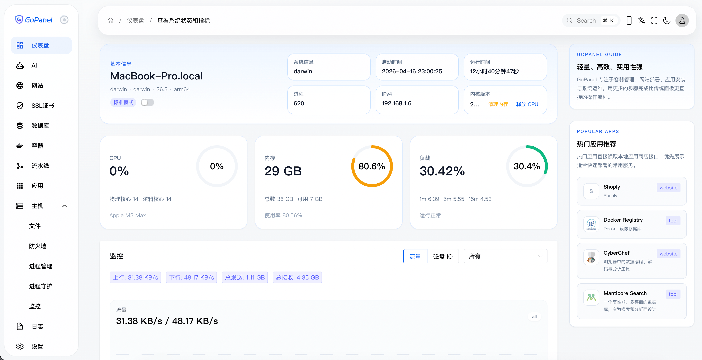

# GoPanel

_[English version](./README.md)_

官方网站：https://gopanel.cn/

GoPanel 是一款由 Golang 开发、面向开发者与独立团队的现代化轻量级服务器管理面板，也是一个以 Docker 为核心的应用运行与网站部署平台。它不追求“大而全”的功能堆砌，而是把高频、关键的运维与交付动作收敛成一套更清爽、更快、更好理解的工作流。

GoPanel 让你用一套工作台统一管理：

- 网站托管：静态站 / 反向代理 / 容器化 Web 应用
- 容器与应用生命周期：启动 / 停止 / 日志 / 资源占用
- 数据库与中间件：一键安装与面板内维护
- CI/CD 流水线：拉代码 → 构建 → 发布 → 版本切换
- 域名 / 证书 / HTTPS：更顺滑的上线闭环
- 内置 AI 协作与排障：把“命令、经验、记录”沉淀在面板里

无论你是想：

- 在一台新服务器上快速拉起应用环境
- 用容器方式管理数据库、缓存与服务
- 让静态站、反向代理、容器化 Web 应用统一接入
- 通过流水线完成代码拉取、构建、发布与版本切换
- 在一套面板里完成 AI 辅助、应用安装、日志查看与日常运维

GoPanel 都希望让这些动作变得足够直接，而不是让你在复杂配置和臃肿菜单中来回穿梭。

## ⚡ 快速开始

```bash
bash <(curl -fsSL https://gopanel.run)
```

## 🖼 界面预览



上图展示的是 GoPanel 当前的整体风格：统一的信息密度、清晰的功能分区、偏工作台式的布局，以及围绕“主机 / 网站 / 容器 / 流水线 / 应用 / AI 助手”构建的一体化操作体验。

## 🌟 为什么选择 GoPanel

相比传统服务器面板，GoPanel 更强调以下几件事：

- **更轻的心智负担**：把高频能力聚焦在“网站、容器、应用、数据库、流水线、日志、安全设置”这些真正常用的模块上，让新机器接入、站点上线、应用运行都更直观。
- **以容器为默认运行方式**：数据库、中间件、业务服务与网站运行环境天然隔离，迁移、备份、回滚和多环境管理更自然。
- **内置 HTTP 服务与完整访问入口**：面板自身即内置 Web 服务能力，不依赖额外 Nginx 才能启动；结合网站模块、反向代理与统一入口配置，可以更自然地接管静态站点、容器应用和域名流量。
- **进程守护与长期稳定运行**：内置守护与自恢复机制，默认支持 `systemd`、运行状态管理与异常拉起，适合把 GoPanel 作为长期在线的正式面板，而不是一次性脚本工具。
- **自动 CDN 与证书签发能力**：不仅可以处理基础 HTTPS，还能围绕域名解析、证书签发、自动续期与 CDN 推送形成闭环，让站点上线后的安全与分发能力更完整。
- **内置数据库管理工作台**：不仅能安装和运行数据库容器，还能直接在面板内完成数据库、表结构、连接信息与常见维护动作的管理，减少在 SSH、CLI 与第三方工具之间来回切换。
- **从部署到发布的一条链路**：不仅能管理运行中的服务，还能通过流水线拉代码、执行脚本、打包制品、触发网站发布，把“构建”和“上线”真正连成闭环。
- **真正适合长期使用的单二进制架构**：后端采用 Golang，前端静态资源直接内嵌或打包到程序中，部署简单、依赖少、升级路径清晰，适合自托管与长期维护。
- **内置自更新能力**：可直接基于 GitHub Releases 完成版本检查、下载、替换与重启，省去额外写升级脚本、同步文件和人工覆盖的麻烦。
- **跨平台友好**：Linux 可作为正式生产面板运行；macOS 与 Windows 也能作为本地开发环境、调试环境或演示环境使用。

## ✨ 你能得到什么

使用 GoPanel，你会得到一套围绕“上线效率”和“运维秩序”重新组织过的工作台：

- **仪表盘**：快速掌握 CPU、内存、磁盘、网络与热门应用信息，首页就是状态总览。
- **AI 助手**：支持按工作组管理 AI 对话，把日常命令、代码协作、排障与记录沉淀在面板内部。
- **网站系统**：支持静态站、反向代理、容器化应用，以及与流水线构建结果联动的发布模式。
- **HTTP 与访问控制入口**：内置 HTTP 服务、统一入口配置与域名接入能力，不需要再围绕“先装一个外部 Web Server 才能跑面板”来兜圈子。
- **数据库与容器管理**：统一查看运行状态、端口、版本、日志与资源占用；同时内置数据库管理能力，让数据库维护也能留在同一套控制台里完成。
- **证书 / CDN / 域名闭环**：支持围绕域名、证书签发、自动续签、DNS 与 CDN 推送的持续化管理，让线上站点不只是“能访问”，而是“可持续托管”。
- **进程守护与运行管理**：对长期运行的服务、任务与面板本身提供更稳定的守护式体验，适合正式生产环境长期部署。
- **流水线工作台**：拉代码、构建、记录执行历史、查看日志、发布版本，适合做简单而高频的 CI/CD 场景。
- **应用商店**：直接安装常见服务，适合快速搭环境、拉中间件与部署常用业务组件。

## 🧭 产品理念

GoPanel 从设计之初就遵循三条非常明确的原则：

- **少而精**：不做大而全的功能堆砌，而是让每个模块都围绕高频场景足够顺手。
- **统一入口**：把原本散落在 SSH、Docker、反向代理、脚本、部署记录里的动作，尽量收敛到一套一致的界面和操作路径中。
- **对开发者友好**：既能满足“快速装好就能用”，也保留了足够的工程化能力，适合持续迭代、持续发布和多环境管理。

## 🚀 一键安装与升级

GoPanel 的安装和升级共用同一条极其简单的指令。系统会自动识别您是否已经安装，如果是首次安装会引导配置；如果是已有环境，则会自动拉取最新版并完成“无感升级”。

```bash
bash <(curl -fsSL https://gopanel.run)
```

**系统兼容性**：

- **Linux**: 默认安装至 `/opt/gopanel`，并自动配置 `systemd` 开机自启服务。
- **macOS / Windows**: 默认安装至 `~/.gopanel`，适合作为本地开发辅助工具。

## 🛠 开发与构建

- **开发环境**：Go 1.25.1 / Node.js 20+
- **依赖安装**：`go mod tidy`
- **启动服务**：`go run main.go`

### 运行 GoPanel 本地版本

```bash
git clone https://github.com/aihop/gopanel.git

cd gopanel

go run main.go

```
