# GoPanel Flow 产品与开发规划

## 1. 产品定义

GoPanel Flow 是连接 Code、Pipeline、Release、Deployment、Container、Website 和 Mobile 的应用发布流程。

它面向一人公司和小型产品团队，把“开发完成之后还要手工切换多个系统”的过程收口为一条可追踪、可暂停、可恢复的主流程：

```text
开发完成 → 构建制品 → 部署预览 → 验收 → 发布生产 → 验证与回滚
```

Flow 的价值不是增加新的构建、容器或网站能力，而是让现有能力按照稳定契约协同工作，让用户只在验收和高风险节点做决策。

### 1.1 产品承诺

- 同一个源代码 Commit 只构建一次。
- 预览和生产使用同一个不可变 Release。
- 用户随时知道当前进行到哪一步、为什么停止、下一步需要做什么。
- 服务重启、网络中断或重复点击不会造成重复构建、重复部署或重复切流。
- 线上版本可以反查到需求、AI 任务、Commit、构建记录和部署记录。
- 新版本验证失败时不影响旧版本继续提供服务，并能明确恢复到上一个可用版本。
- 上线后持续监听生产地址，异常与恢复都形成结构化事件并通知用户。

### 1.2 非目标

- 不做 Jenkins、GitHub Actions 一类任意节点的通用工作流引擎。
- 不提供自由拖拽、条件表达式或脚本节点市场。
- 不重写现有 Code、Pipeline、Container、Website 模块。
- 不让 Flow 直接执行 Git、构建脚本、Docker 或 Caddy 命令。
- 不默认自动执行生产数据库写入、域名变更、证书变更和不可逆迁移。

## 2. 核心原则

### 2.1 Flow 只编排，不替代

Flow 只负责：

1. 保存发布方案和环境配置。
2. 创建一次发布运行并推进状态。
3. 调用现有模块的应用服务。
4. 等待并核对模块返回的结构化结果。
5. 在需要人工决策时暂停并生成待办。
6. 记录跨模块关联、审计信息和恢复位置。

具体动作仍由原模块完成。Flow 不复制任何模块内部实现。

### 2.2 制品不可变

`Release` 是 Flow 的交付边界：

```text
确定 Commit + 构建配置快照 → PipelineRecord → Release
```

Release 创建后不得被原地替换。修复必须产生新的 Commit、PipelineRecord 和 Release。镜像应优先保存 digest；只有 tag 时也必须确保 tag 不会被后续构建覆盖。

### 2.3 预览自动，生产审批

- 开发交付、构建、Release 创建和预览部署默认自动推进。
- 预览通过健康检查后等待用户验收。
- 生产部署默认需要明确审批。
- 生产部署后的健康检查、切流和失败恢复由系统自动完成。
- 数据库写入、首次环境初始化和敏感配置变化使用独立风险审批。

### 2.4 状态属于后端

Web 和 Mobile 只展示后端 Flow 状态，不在客户端拼接 Code、Pipeline、Website 的状态来推断发布进度。原始日志仍由各模块保存，Flow 只保存适合列表和手机展示的结构化摘要及引用。

## 3. 领域术语

| 名称 | 含义 |
|------|------|
| Flow | 一个项目的发布方案，定义唯一构建 Pipeline 和环境顺序，不表示任意流程图 |
| Flow Environment | 预览或生产环境，引用 Website、健康检查和审批策略 |
| Flow Run | 某个确定 Commit 的一次端到端发布运行 |
| Flow Stage Run | Flow Run 中某一步的追加式执行记录 |
| Code Delivery | 现有 Code 模块的代码合并、推送与交付，不等于应用发布 |
| Pipeline Record | 一次构建执行，输入必须包含确定 Commit |
| Release | Pipeline 生成的不可变可部署制品 |
| Deployment | 将 Release 部署到某个环境的一次运行记录 |
| Website | 域名、证书、Caddy 和流量入口，不负责构建制品 |
| Runtime Health Event | 发布完成后的应用故障与恢复事件，不属于新的 Flow Run 阶段 |

## 4. 模块职责与边界

| 模块 | 必须负责 | 明确不负责 | 向 Flow 提供的事实 |
|------|----------|------------|--------------------|
| Task Contract | 目标、范围、风险、验收标准 | 执行构建或部署 | 契约版本、哈希、验收项 |
| Code | AI 开发、Worktree、代码质量、评审、合并和推送 | 生成生产制品、启动生产容器、绑定域名 | 项目、任务、目标分支、最终 Commit、交付结果 |
| Flow | 跨模块状态机、幂等触发、审批、待办、恢复和汇总 | 执行 Git、构建、容器、Caddy 命令 | Flow Run 状态、下一动作、跨模块引用 |
| Pipeline | 按确定 Commit 构建、测试、归档或生成镜像 | 长期持有生产运行实例、切换网站流量 | PipelineRecord、实际 Commit、日志、制品元数据 |
| Release | 固化 Commit 与制品身份 | 执行部署、承载可变环境配置 | Release ID、制品类型、位置/digest、Commit |
| Deployment | 用 Release 创建运行实例、注入环境配置、就绪检查、切流验证和恢复 | 构建源码、管理域名 | Deployment ID、容器、端口、健康状态、旧版本 |
| Container | 提供容器运行时原语和原始日志 | 判断业务是否应该发布 | 容器 ID、状态、端口、运行时错误 |
| Website | 域名、证书、Caddy 配置、流量切换和上游主动健康检查策略 | 拉取源码、构建镜像、决定是否回滚 | Website ID、访问 URL、当前流量目标、上游健康策略 |
| Runtime Health | 周期探测生产地址、确认连续失败与恢复、生成运行事件和告警 | 推进发布状态、直接修改 Caddy | Deployment/Environment 健康状态、事件和探测证据 |
| Approval/Audit | 风险分级、审批决策、操作审计 | 代替业务状态机 | 决策人、原因、时间、动作和资源 |
| Web/Mobile | 展示统一进度、预览、待办和操作入口 | 自行推断跨模块状态 | 用户动作和展示反馈 |

### 4.1 禁止的跨层调用

- Code 不直接调用 Docker 或修改 Website。
- Pipeline 不直接修改生产 Website。
- Website 不按分支拉代码，也不执行构建脚本。
- Flow 不通过 HTTP 回调自己；同进程内调用应用服务，跨节点后再使用签名协议。
- 前端不在本地把多个模块接口拼成 Flow Run。
- 各模块不得修改其他模块的内部状态；只能提交请求或消费公开结果。

## 5. 标准发布流程

```mermaid
flowchart LR
    A["Code 交付确定 Commit"] --> B["Pipeline 锁定 Commit 构建"]
    B --> C["生成不可变 Release"]
    C --> D["部署预览实例"]
    D --> E["内部健康检查"]
    E --> F["发布预览 URL"]
    F --> G["用户验收"]
    G --> H["生产发布审批"]
    H --> I["部署同一个 Release"]
    I --> J["内部健康检查"]
    J --> K["Website 切流"]
    K --> L["外部地址验证"]
    L --> M["进入上线稳定窗口"]
    M --> N["持续运行健康监听"]
```



### 5.1 用户主流程

1. 用户在 Code 中完成开发和评审。
2. Code 交付成功后显示唯一主操作“生成预览”；项目开启自动预览时直接开始。
3. Flow 创建运行，使用 Code 返回的最终 Commit 触发 Pipeline。
4. 构建完成后 Flow 自动创建 Release，并部署到预览环境。
5. 预览健康检查成功后，预览 URL 自动回写 Code 会话并发送通知。
6. 用户在 Web 或 Mobile 打开预览，只需选择“继续修改”或“验收并发布”。
7. “继续修改”结束当前 Run，保留预览和证据，新修改产生新的 Commit 与 Run。
8. “验收并发布”记录验收证据，进入生产审批；低风险项目可合并为一次确认。
9. 系统将同一个 Release 部署到生产，验证新实例后切换 Website 流量。
10. 外部验证成功后进入稳定窗口；窗口内失败则保留或恢复旧实例并生成待处理事项。
11. 稳定窗口通过后完成 Run，并持续监听生产地址；后续异常归入当前 Deployment/Environment 的运行事件，不篡改已完成的 Flow Run。

### 5.2 用户始终只看到一个主状态

```text
开发完成 ✓  构建完成 ✓  预览可用 ✓  等待验收 ●  生产发布 —
```

每个状态只展示：

- 当前发生了什么。
- 已等待多久。
- 是否需要用户操作。
- 唯一推荐的下一步。
- 查看原始日志和高级操作的次级入口。

## 6. 状态机

### 6.1 Flow Run 阶段

| 阶段 | 自动推进条件 | 失败处理 |
|------|--------------|----------|
| `code_delivered` | Code Delivery 完成且得到 Commit | 缺少 Commit 时拒绝创建 Run |
| `build_queued` | Pipeline 请求创建成功 | 可安全重试创建请求 |
| `building` | PipelineRecord 正在执行 | 停止并展示构建错误 |
| `release_ready` | Pipeline 成功且实际 Commit 匹配 | Commit 不匹配视为安全错误 |
| `preview_deploying` | Release 可用于目标环境 | 保持线上环境不变 |
| `preview_verifying` | 预览实例已启动 | 停止、保留诊断信息 |
| `preview_ready` | 内部和外部预览探测成功 | 不进入验收 |
| `awaiting_acceptance` | 已向用户展示预览 | 等待用户，不自动超时发布 |
| `production_approved` | 验收与生产审批完成 | 审批拒绝则结束 Run |
| `production_deploying` | 生产 Deployment 已创建 | 旧实例继续服务 |
| `production_verifying` | 新实例内部探测成功并已切流 | 外部验证失败则恢复旧目标 |
| `production_stabilizing` | 外部验证成功，持续检查到稳定窗口结束 | 连续失败则按策略恢复旧目标 |
| `completed` | 稳定窗口通过且关联已固化 | 终态；后续故障另建运行事件 |

### 6.2 运行状态

阶段表示业务位置，状态表示该阶段是否可继续：

```text
queued / running / waiting / succeeded / failed / cancelled / rolled_back
```

不得用新增阶段名表达失败，例如不增加 `build_failed`。失败信息保存在当前阶段的 `status`、`failureCode` 和 `errorSummary` 中，避免状态组合无限增长。

### 6.3 恢复规则

- Flow Worker 只领取 `queued` 或租约过期的 `running` Run。
- 每个外部动作使用稳定幂等键：`flowRunId + stage + environmentId`。
- 已有关联 ID 时先查询真实状态，不重复创建下游对象。
- 进程在发出请求后崩溃时，通过幂等键找回已有 PipelineRecord、Release 或 Deployment。
- 人工等待状态不持有租约，服务重启后保持等待。
- 自动重试只覆盖瞬时基础设施错误；代码失败、健康检查失败和审批拒绝不自动循环。
- 同一环境同一时间只允许一个进入切流阶段的 Flow Run，使用环境租约串行化。

## 7. 数据模型建议

### 7.1 `Flow`

```text
id
projectId
name
pipelineId
enabled
autoStartAfterCodeDelivery
createdBy
```

第一期一个项目最多一个启用的 Flow。Flow 不保存任意节点 JSON，流程拓扑由产品版本定义。

### 7.2 `FlowEnvironment`

```text
id
flowId
name                    preview / production
websiteId
autoDeploy
approvalRequired
healthCheckPath
healthCheckSuccessCount
externalVerifyTimeoutSeconds
stabilizationMinutes
runtimeMonitorEnabled
runtimeFailureThreshold
runtimeRecoveryThreshold
autoRollbackDuringStabilization
retainPreviousMinutes
sort
enabled
```

敏感环境变量不直接存入 FlowEnvironment；只保存对现有凭据/配置对象的引用。

`healthCheckPath` 默认读取 Website Upstream 已有的 `healthUri`，不在 Flow 中维护第二份互相漂移的路径配置；FlowEnvironment 只保存发布门禁、持续监听和回滚策略。Website Upstream 已有的 `healthInterval`、`healthTimeout` 继续用于 Caddy 主动检查。

`pipelineId` 只属于 Flow，不属于环境。一个 Flow Run 只执行一次 Pipeline 并生成一个 Release，所有环境消费同一个 Release；若预览和生产需要不同的构建方式，应拆成不同 Flow，而不是在同一 Run 中重新构建。

### 7.3 `FlowRun`

```text
id
flowId
projectId
sessionId
taskId
codeDeliveryJobId
sourceRepository
sourceBranch
sourceCommit
pipelineRecordId
releaseId
previewDeploymentId
productionDeploymentId
currentStage
status
failureCode
errorSummary
requestedBy
approvedBy
startedAt
completedAt
leaseOwner
leaseExpiresAt
```

`sourceCommit` 创建后不可修改。后续所有阶段必须核对自身实际 Commit 与该值一致。

### 7.4 `FlowStageRun`

```text
id
flowRunId
stage
attempt
status
idempotencyKey
resourceType
resourceId
summary
errorCode
errorDetail
startedAt
completedAt
```

该表只追加，不覆盖历史尝试，用于恢复、审计和效能统计。大体积日志只保存引用，不复制到 Flow 表。

### 7.5 现有模型需要补充的关联

- `PipelineRecord`：`expectedCommit`、`sourceType`、`sourceId`、`idempotencyKey`。
- `Release`：标准 Artifact Manifest、镜像 digest，并保持 `pipelineRecordId` 唯一。
- `AppDeploy`：`releaseId`、`pipelineRecordId`、`commitHash`、`flowRunId`、`environmentId`、`previousDeploymentId`、健康检查状态。
- `AIPreview`：允许 `source=flow`，并关联 `flowRunId`、`deploymentId`。
- 通用审批对象：后续支持 `actionType=production_release/database_migration/config_change`，不要继续只依赖危险关键词。

## 8. 跨模块契约

### 8.1 Code → Flow

只有 Code Delivery 达到完成终态后才能发起：

```json
{
  "projectId": 12,
  "sessionId": 81,
  "taskId": 203,
  "codeDeliveryJobId": 52,
  "repository": "primary",
  "branch": "main",
  "commit": "full-commit-sha"
}
```

多仓任务第一期只选择一个可部署主仓；其他仓库 Commit 作为 `sourceManifest` 固化。若缺少主仓或 Commit 不可从远端获取，Flow 必须阻止构建并给出可操作原因。

### 8.2 Flow → Pipeline

```json
{
  "pipelineId": 9,
  "version": "flow-143-abc1234",
  "expectedCommit": "full-commit-sha",
  "sourceType": "flow_run",
  "sourceId": 143,
  "idempotencyKey": "flow:143:build"
}
```

Pipeline 必须 checkout `expectedCommit`，并在构建前后验证 HEAD。只拉取分支最新 HEAD 不满足 Flow 契约。

### 8.3 Pipeline → Release

Pipeline 成功后产生标准 Manifest：

```json
{
  "schemaVersion": 1,
  "type": "container_image",
  "commit": "full-commit-sha",
  "image": "registry.example/app@sha256:...",
  "archiveFile": "",
  "startCommand": "",
  "port": 3000,
  "healthCheckPath": "/health"
}
```

支持的第一期制品类型：

- `static_archive`：静态目录 ZIP。
- `container_image`：不可变镜像引用。

Runner 容器可用于构建验证，但不作为生产 Deployment 的事实源。

### 8.4 Flow → Deployment

```json
{
  "releaseId": 66,
  "environmentId": 3,
  "websiteId": 21,
  "flowRunId": 143,
  "idempotencyKey": "flow:143:deploy:preview"
}
```

Deployment 必须返回记录 ID，而不是只启动 goroutine 后返回成功。Flow 通过记录状态推进，不解析日志文本。

### 8.5 Deployment → Website

容器应用的安全切流顺序：

```text
创建新容器
→ 等待运行时 Running
→ 内部端口/HTTP 健康检查连续成功
→ 原子更新 Website 目标并应用 Caddy
→ 从外部 URL 再次验证
→ 保留旧容器到回滚窗口结束
→ 清理旧容器
```

静态网站使用新 Release 目录切换 `SiteDir`，同样保留旧目录作为回滚点。

### 8.6 Website 与 Runtime Health → Flow

应用健康分成三个层次，三者不能用一个“容器 Running”代替：

| 层次 | 执行者 | 探测目标 | 作用 |
|------|--------|----------|------|
| 切流前就绪检查 | Deployment | 新容器内网端口和 `healthUri` | 未通过时禁止 Website 指向新容器 |
| 切流后发布验证 | Deployment | 用户实际访问的 Website URL | 验证域名、TLS、Caddy 和应用整条链路 |
| 上线后持续监听 | Caddy + Runtime Health | 上游 `healthUri` 与生产 URL | 避开异常上游，形成告警、恢复和运行可用性事实 |

第一期复用 Website Upstream 已有的 `healthUri`、`healthInterval`、`healthTimeout` 生成 Caddy 主动健康检查，不重新发明一套反代探针。Runtime Health 在现有告警能力上增加应用目标的周期 HTTP 探测，把 Caddy 之外的域名、证书和公网链路也纳入判断。

持续监听遵守以下规则：

- 单次超时不判故障；连续达到 `runtimeFailureThreshold` 才创建运行事件并通知。
- 连续达到 `runtimeRecoveryThreshold` 后关闭事件并发送恢复通知，避免状态抖动。
- Flow Run 完成后保持不可变；故障关联当前 Deployment、Environment 和 Website。
- 稳定窗口内且旧版本仍可用时，可按环境策略自动恢复旧目标。
- 稳定窗口结束后默认只告警，不把未知运行故障误判为新版本问题；自动恢复必须单独开启并审计。
- 探测记录保存状态码、延迟、失败摘要和时间，响应正文及敏感 Header 不进入日志。

## 9. 审批、安全与审计

### 9.1 风险分层

| 动作 | 默认策略 |
|------|----------|
| 构建确定 Commit | 自动 |
| 部署预览 | 自动 |
| 重新执行失败构建 | 用户确认或明确自动重试策略 |
| 发布生产 | 必须审批 |
| 可逆配置变更 | 审批后执行 |
| 数据库写入/迁移 | 独立审批并展示影响范围 |
| 域名、证书、密钥变化 | 独立审批 |
| 不可逆或无法生成回滚点 | 阻止自动执行 |

### 9.2 审批内容

生产审批必须展示：

- 将发布的项目和环境。
- Source Commit 与变更摘要。
- Release 与构建记录。
- 预览 URL 和验收结果。
- 数据库迁移、配置变化和预计影响。
- 当前生产版本与可回滚目标。

### 9.3 审计要求

Flow Run 的创建、重试、取消、验收、审批、切流和回滚均记录操作者、IP、时间、资源 ID 和结果。Flow 审计保存跨模块摘要，各模块继续保存原始操作细节。

## 10. 丝滑体验设计

### 10.1 入口收口

- Code 会话：开发完成后展示 Flow 状态卡，不要求用户跳到 Pipeline 页面。
- 项目页：展示当前预览和生产版本、最近一次 Flow Run。
- Flow 页面：用于配置环境、查看历史和处理异常，不作为日常必经入口。
- Mobile 待处理：只展示需要人处理的验收、审批和失败恢复。

### 10.2 操作收口

| 当前状态 | 主操作 | 次操作 |
|----------|--------|--------|
| 开发完成 | 生成预览 | 查看代码交付 |
| 构建/部署中 | 无，自动推进 | 查看日志、取消 |
| 预览就绪 | 验收并发布 | 继续修改、查看详情 |
| 等待生产审批 | 确认发布 | 拒绝 |
| 发布失败 | 恢复旧版本/重试安全步骤 | 查看诊断 |
| 已上线 | 打开生产地址 | 查看版本链路、回滚 |

所有按钮由后端返回的 `allowedActions` 决定，前端不自行推断权限和状态组合。

### 10.3 进度与通知

- 列表返回结构化摘要，详情按需加载 Stage Run 和原始日志。
- Web 第一阶段使用短轮询或现有实时通道；后续统一为 Flow 事件流。
- 仅在需要用户处理、预览可用、生产成功或最终失败时通知，避免每个阶段都打扰用户。
- 通知深链直接打开对应 Flow Run 和唯一推荐动作。
- 网络恢复后继续展示后端真实状态，不因单次请求失败跳错误页或丢失运行上下文。

### 10.4 错误文案

错误摘要必须包含：

```text
发生位置 + 直接原因 + 是否影响线上 + 推荐动作
```

例如：

```text
预览部署未通过健康检查；生产环境未受影响。请查看容器日志，修复后重新生成预览。
```

## 11. 后端实现建议

### 11.1 包与文件边界

建议沿现有结构增量增加：

```text
app/model/flow*.go
app/repo/flow*.go
app/service/flow_orchestrator*.go
app/api/flow*.go
app/router/flow.go
```

- API 只做鉴权、绑定和响应包装。
- Repo 只负责 Flow 数据持久化和带条件状态更新。
- Orchestrator 只推进状态和调用应用服务。
- Pipeline、Deployment、Website 的改动留在各自 service 文件中。
- 单文件接近 400 行时按状态机、契约、恢复、视图拆分。

### 11.2 第一阶段运行机制

第一期不引入消息队列：

1. API 或 Code Delivery 完成点创建 Flow Run。
2. 后台 Worker 定期领取可运行记录。
3. 使用数据库租约防止多个 Worker 重复推进。
4. 每次只推进一个可观察步骤，然后持久化并释放控制。
5. 下游长任务由其自身 Worker 执行，Flow 只轮询结构化状态。
6. 服务启动时恢复租约过期的 Run。

当未来需要跨节点和更高吞吐时，再把同一状态机接到事件总线；不得为第一期提前引入新的基础设施。

### 11.3 并发控制

- 同一个 Flow Run 只有一个有效租约。
- 同一 Flow Environment 的生产切流阶段串行执行。
- Pipeline 是否允许并行由 Pipeline 自身决定。
- Code Delivery 的仓库租约继续由 Code 管理，Flow 不重复实现。
- 所有状态更新使用 `WHERE id = ? AND status = ? AND current_stage = ?`，丢失竞争时重新读取。

## 12. API 草案

```text
GET    /flow/projects/:projectId
PUT    /flow/projects/:projectId
GET    /flow/projects/:projectId/environments
POST   /flow/projects/:projectId/environments
PUT    /flow/environments/:id
GET    /flow/runs
GET    /flow/runs/:id
POST   /flow/runs
POST   /flow/runs/:id/retry
POST   /flow/runs/:id/cancel
POST   /flow/runs/:id/accept
POST   /flow/runs/:id/reject
POST   /flow/runs/:id/approve-production
POST   /flow/runs/:id/rollback
```

Flow Run 详情建议统一返回：

```json
{
  "run": {},
  "summary": {},
  "stages": [],
  "environments": [],
  "release": {},
  "deployments": [],
  "previews": [],
  "approval": null,
  "allowedActions": []
}
```

API 返回资源引用和结构化摘要，不复制 Pipeline 或 Container 的完整日志。

## 13. 分期开发计划

### Phase 0：契约加固

目标：保证串联之前每段都有可靠输入输出。

- Pipeline Run 支持并强制验证 `expectedCommit`。
- Release 增加标准 Artifact Manifest 和镜像 digest。
- AppDeploy 恢复 Release、PipelineRecord、Commit 的可追溯字段。
- Deployment 创建立即返回 ID，并提供结构化状态查询。
- 新容器切流前增加内部健康检查，旧容器延迟清理。
- 复用 Website Upstream 健康配置，补齐外部 URL 验证和结构化探测结果。

验收：手动调用现有模块，也能完成“指定 Commit → Release → 可追溯 Deployment → 安全切流”。

#### 现状差距与首批改动位置

| 差距 | 当前事实 | 第一改动入口 |
|------|----------|--------------|
| Pipeline 不能锁定 Commit | Run 只接收 Pipeline ID 与版本，执行时拉分支 HEAD | `app/dto/request/pipeline.go`、`app/service/pipeline_execute.go`、`app/service/pipeline_steps.go` |
| Release 缺少标准 Manifest/digest | 现有 Release 主要保存 tag、ZIP 和目录 | `app/model/pipeline.go`、`app/service/pipeline_application_release.go` |
| Deployment 缺少上游溯源 | AppDeploy 未保存 Release、PipelineRecord、Commit | `app/model/app_deploy.go`、`app/repo/app_deploy.go` |
| 部署触发无法可靠等待 | Trigger 启动后台任务后只返回通用成功 | `app/api/app_deploy.go`、`app/service/app_deploy_application.go` |
| 容器未健康即切流 | 新容器启动后立即更新 Website，再清理旧容器 | `app/service/app_deploy_website.go`、`app/service/app_deploy_utils.go` |
| 上游健康检查未形成发布事实 | Caddy 已消费 Website Upstream 的健康参数，但 Flow/Deployment 尚无结构化验证结果 | `app/model/website_upstream.go`、`app/service/website_upstream.go`、`app/service/caddy_apply.go` |
| 手机任务由客户端聚合 | Task Center 分别请求多套接口 | Phase 3 再由 Flow/Attention 后端摘要替代，不在 Phase 0 扩大范围 |

### Phase 1：轻铺预览闭环

目标：用一个真实项目证明核心价值。

- 新增 Flow、FlowEnvironment、FlowRun、FlowStageRun。
- 配置轻铺的 Preview Environment。
- Code Delivery 完成后创建 Flow Run。
- 自动触发构建、创建 Release、部署预览。
- 将预览 URL 写回 Code 会话和 Mobile。
- 提供恢复 Worker、幂等键和失败待办。

验收：从 Code 点击一次后，不进入 Pipeline、Container、Website 页面即可看到可用预览。

### Phase 2：生产发布闭环

目标：手机完成验收和安全上线。

- 配置 Production Environment。
- 增加预览验收和生产审批。
- 使用同一 Release 部署生产。
- 内部探测、切流、外部探测和自动恢复。
- 上线稳定窗口持续验证，连续失败时自动恢复旧目标。
- 线上版本展示任务、Commit、Release、Deployment 全链路。

验收：手机点击“验收并发布”后自动完成上线，失败时旧版本继续服务。

### Phase 3：统一待办与效能

目标：让用户管理结果，而不是守流程。

- 将 Flow 待办接入统一 Attention/Task 摘要。
- 增加深链通知和发布历史。
- 统计开发交付到首个预览、预览到上线、人工介入次数、失败恢复次数。
- 将任务契约验收项与 Flow 验收证据关联。
- 将生产 Website 周期探测接入现有告警引擎，展示故障与恢复事件。

验收：可以量化 GoPanel 是否缩短轻铺从需求到上线的周期。

### Phase 4：受控扩展

只有真实项目需要时再增加：

- 多个预览环境。
- 灰度或蓝绿发布。
- 跨节点部署。
- 数据库迁移计划与恢复策略。
- 多仓制品组合。

仍不增加任意拖拽工作流。

## 14. 测试与验证策略

### 14.1 单元测试

- 状态转换和非法转换。
- 幂等键与重复请求。
- 租约领取、过期恢复和环境串行化。
- allowedActions 与权限。
- Commit、Release Manifest 和 Deployment 溯源校验。

### 14.2 集成测试

- Code Delivery 完成后只创建一个 Flow Run。
- Pipeline 实际 Commit 不一致时停止。
- Pipeline 成功后只创建一个 Release。
- Worker 崩溃重启后找回已有下游记录。
- 预览健康检查失败不触发生产。
- 生产新实例失败时旧实例继续服务。
- 切流成功但外部验证失败时恢复旧目标。
- 稳定窗口内连续探测失败时只生成一次事件并恢复旧目标。
- 稳定窗口外故障只告警，不篡改已完成 Flow Run 或擅自回滚。
- 连续成功达到恢复阈值后关闭运行事件并发送恢复通知。

### 14.3 端到端验收

用轻铺固定一条可重复场景：

```text
提交一个用户可见的小改动
→ Code 交付
→ 自动生成预览
→ 手机验收
→ 发布生产
→ 验证生产页面包含该改动
→ 查看完整溯源链路
```

另做一次故意失败的健康检查，确认生产不受影响且手机收到可处理的待办。

再在发布完成后停止当前生产容器，确认持续监听能发现真实 Website 不可用、避免重复告警，并在服务恢复后产生恢复事件。

## 15. 产品成功指标

第一阶段不以 Flow 配置数量衡量成功，使用真实交付结果：

- `code_delivered → preview_ready` 的中位耗时。
- `preview_ready → completed` 的中位耗时。
- 每次发布需要打开的 GoPanel 模块页面数，目标为 1。
- 每次发布需要人工操作的次数，常规预览目标为 0，生产目标为 1。
- Flow Run 自动恢复成功率。
- 生产发布失败但旧版本保持可用的比例。
- 生产网站故障发现时间和恢复事件闭环率。
- Release 可完整反查到 Task 与 Commit 的比例，目标为 100%。

## 16. 开发决策检查表

新增 Flow 功能前逐项确认：

- 是否复用了现有模块，而不是复制实现？
- 是否保持“一个 Commit 构建一次、同一 Release 进入预览和生产”？
- 是否有稳定幂等键和重启恢复路径？
- 是否返回结构化状态，而不是让调用方解析日志？
- 是否明确失败对当前线上环境的影响？
- 是否区分发布门禁、稳定窗口和上线后持续监控？
- 是否只在真正需要人决策的地方暂停？
- 是否能从线上实例追溯到任务、Commit、构建和 Release？
- 是否让用户少切一个页面、少做一次重复确认？

任何一项答案为否，都不应宣称该阶段已经形成可靠 Flow。
